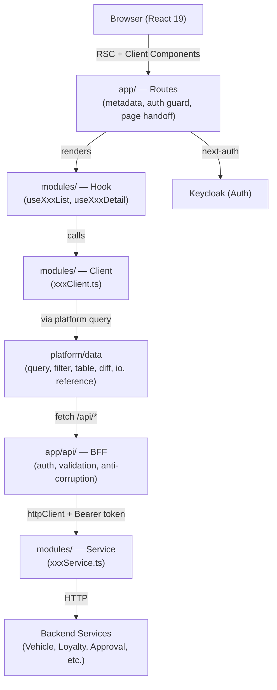

# Design Document: operator-portal-refactor

## Overview

`operator-portal-refactor` là bản rebuild toàn diện của `operator-portal` — một Next.js 15 admin portal
phục vụ nghiệp vụ vận hành nội bộ. Mục tiêu là giữ nguyên toàn bộ nghiệp vụ hiện có, đồng thời nâng cấp
kiến trúc theo mô hình **platform-first, workflow-first**.

### Phân tích codebase hiện tại

Sau khi nghiên cứu kỹ `operator-portal`, các điểm mạnh cần giữ lại:

- `PaginationDataTable` — DnD, pin, visibility đã hoạt động tốt với `@dnd-kit`. Giữ nguyên logic, chỉ
  migrate sang Zustand thay sessionStorage và thêm sort vào `...` dropdown.
- `compare()` + `ApprovalRequestComparator` — thuật toán deep-diff với `normalize()` và `walk()` đệ quy
  rất tốt. Giữ nguyên logic, nâng cấp thành `platform/data/diff/` với typed `FieldType` renderer.
- `VehicleSpecProvider` — pattern React Context + `useQuery` với `staleTime: Infinity` cho reference-data
  cache là đúng hướng. Generalize thành `ReferenceDataProvider<T>` trong `platform/data/reference/`.
- IO pipeline (`importService`, `ImportSpec`, `ExportSpec`) — kiến trúc pipeline với `DatasetSink`,
  `DatasetProgress`, `businessValidateRow`, `businessValidateDataset` rất solid. Giữ nguyên, chỉ relocate
  vào `platform/data/io/`.
- `ApprovalRequestDetail` / `VehicleRequestDetail` — pattern `Group<T>` với `isDisplay` predicate và
  `element` renderer là đúng. Generalize thành `RecordManifest` trong `platform/page/record/`.
- `LoyaltyTransactionDetail` — multi-mode form với `modeConfig` map là pattern hay. Formalize thành
  `WorkflowFormMode` trong `platform/interaction/workflow/`.

Các vấn đề cần fix:

- `PaginationDataTable` dùng `sessionStorage` trực tiếp → migrate sang Zustand store.
- `GenericList` dùng `useListFilterStore.getState()` trong render (anti-pattern) → fix với proper hook.
- `ApprovalRequestDetail` và `VehicleRequestDetail` duplicate gần như hoàn toàn → merge thành một.
- Filter state không có 3-state model (draft/applied/request) → thêm vào.
- Không có sort trong column header dropdown → thêm vào `...` menu cùng với pin options.

**Nguyên tắc thiết kế cốt lõi:**
- Platform-first: xây dựng các engine tái sử dụng trước khi migrate module
- Workflow-first: page archetypes phản ánh nghiệp vụ thực tế, không phải widget names
- Single source of truth: một table system, một filter system, một data pipeline
- Module = manifest + hook + schema + slot — không duplicate infrastructure

---

## Architecture

### Folder Structure

```
src/
  app/                    → routes only (metadata, auth guard, page handoff)
    api/                  → BFF route handlers
    (dashboard)/
    vehicle/
    loyalty/
    evoucher/
    ecommerce/
    merchant/
    system/

  core/                   → types, enums, auth helpers (no React, no axios)
    types/
    enums/
    auth/

  platform/               → reusable engines
    design/               → tokens, spacing, typography
    layout/               → AppShell, ContentFrame
    navigation/           → Sidebar, Topbar, Breadcrumbs
    state/                → loading/empty/error/not-found state views
    ui/                   → primitive + semantic wrappers
    page/                 → page archetypes + page child blocks
    data/                 → api transport, query, filter engine, table engine,
                            reference-data, diff engine, io pipeline
    interaction/          → form infrastructure, workflow action patterns
    media/                → image viewer, gallery, upload, PDF viewer

  modules/                → domain logic
    vehicle/
      list/
      detail/
      request/
    loyalty/
      transaction/
      request/
      member/
    evoucher/
      issuance/
    ecommerce/
      product/
      order/
    system/
      user/

  shared/                 → utils, constants, i18n
    utils/
    constants/
    i18n/
```

Mỗi module feature có cấu trúc:

```
modules/<domain>/<feature>/
  api/          → module client + service + mapper
  hooks/        → useXxxList, useXxxDetail, useXxxWorkflow
  manifests/    → list-manifest.ts, table-manifest.ts, filter-manifest.ts, record-manifest.ts
  pages/        → thin page components
  schema/       → zod schemas
  slots/        → module-specific exceptions (status badge, action bar, diff renderer)
  components/   → domain-specific UI (không generic)
```

### Data Flow

```
route page → module hook → module client → platform/data query → app/api BFF → module service → backend
```

Rules:
- Không fetch trực tiếp trong component
- Một normalized shape per use case
- BFF là anti-corruption layer giữa FE contract và backend contract

### Architecture Diagram



---

## Components and Interfaces

### platform/design — Design Tokens

ShadcnUI đã định nghĩa đầy đủ CSS variables với `oklch` color space, hỗ trợ light/dark mode tự động
qua `.dark` class. **Không hardcode hex values** — design tokens chỉ là alias và semantic mapping
trên top của ShadcnUI variables đã có.

**Nguyên tắc:** `globals.css` chỉ cần thêm portal-specific semantic tokens (success, warning, info)
và override `--primary` theo brand color. Tất cả còn lại dùng ShadcnUI variables.

```css
/* globals.css — chỉ thêm portal-specific tokens, không override ShadcnUI defaults */
:root {
  /* Portal semantic colors — thêm mới, không có trong ShadcnUI mặc định */
  --success: oklch(0.723 0.219 149.579);          /* green — dùng cho status APPROVED, COMPLETED */
  --success-foreground: oklch(0.982 0.018 155.826);
  --warning: oklch(0.769 0.188 70.08);            /* amber — dùng cho status PENDING */
  --warning-foreground: oklch(0.141 0.005 285.823);
  --info: oklch(0.6 0.118 184.704);               /* cyan — dùng cho status PUBLISHED */
  --info-foreground: oklch(0.985 0 0);
}

.dark {
  --success: oklch(0.696 0.17 162.48);
  --success-foreground: oklch(0.393 0.095 152.535);
  --warning: oklch(0.769 0.188 70.08);
  --warning-foreground: oklch(0.141 0.005 285.823);
  --info: oklch(0.6 0.118 184.704);
  --info-foreground: oklch(0.985 0 0);
}
```

`platform/design/tokens.ts` chỉ export **semantic Tailwind class names** — không chứa hex values:

```typescript
// platform/design/tokens.ts
// Spacing — dùng Tailwind scale, không hardcode px
export const spacing = {
  xs: "gap-1",      // 4px
  sm: "gap-2",      // 8px
  md: "gap-4",      // 16px
  lg: "gap-6",      // 24px
  xl: "gap-8",      // 32px
} as const

// Semantic color classes — map tới CSS variables, adaptive với light/dark
export const semanticColors = {
  // Backgrounds
  pageBg:    "bg-background",       // var(--background) — tự đổi theo theme
  surfaceBg: "bg-card",             // var(--card)
  mutedBg:   "bg-muted",            // var(--muted)
  // Text
  textPrimary:   "text-foreground",       // var(--foreground)
  textSecondary: "text-muted-foreground", // var(--muted-foreground)
  // Border
  border: "border-border",          // var(--border)
  // Status — dùng portal-specific tokens
  success: "bg-[--success] text-[--success-foreground]",
  warning: "bg-[--warning] text-[--warning-foreground]",
  info:    "bg-[--info] text-[--info-foreground]",
  danger:  "bg-destructive text-destructive-foreground",
} as const

// Typography — Tailwind text classes
export const typography = {
  body:   "text-sm",          // 14px
  bodyLg: "text-base",        // 16px
  h1:     "text-xl font-semibold",   // 20px
  h2:     "text-lg font-semibold",   // 18px
  label:  "text-xs font-medium text-muted-foreground uppercase tracking-wide",
} as const

// Radius — dùng Tailwind radius scale (mapped từ --radius trong globals.css)
export const radius = {
  sm: "rounded-sm",   // calc(var(--radius) - 4px)
  md: "rounded-md",   // calc(var(--radius) - 2px)
  lg: "rounded-lg",   // var(--radius)
  xl: "rounded-xl",   // calc(var(--radius) + 4px)
} as const
```

**Mapping ShadcnUI variables → portal usage:**

| ShadcnUI Variable | Tailwind Class | Portal Usage |
|---|---|---|
| `--background` | `bg-background` | Page background |
| `--card` | `bg-card` | Card, panel surface |
| `--muted` | `bg-muted` | Table header, subtle bg |
| `--foreground` | `text-foreground` | Body text |
| `--muted-foreground` | `text-muted-foreground` | Labels, secondary text |
| `--border` | `border-border` | All borders |
| `--primary` | `bg-primary text-primary-foreground` | Primary action buttons |
| `--destructive` | `bg-destructive text-destructive-foreground` | Danger actions, FAILED status |
| `--success` (portal) | `bg-[--success]` | APPROVED, COMPLETED status |
| `--warning` (portal) | `bg-[--warning]` | PENDING, WARNING status |
| `--info` (portal) | `bg-[--info]` | PUBLISHED status |

### platform/ui — Primitive & Semantic Wrappers

**Primitive wrappers** — lock tokens, density, baseline visual consistency:

```typescript
// platform/ui/button.tsx
export type ButtonVariant = "primary" | "secondary" | "danger" | "ghost" | "outline"

export interface ButtonProps extends Omit<ShadcnButtonProps, "variant"> {
  variant?: ButtonVariant
}

const variantMap: Record<ButtonVariant, ShadcnButtonProps["variant"]> = {
  primary: "default",
  secondary: "secondary",
  danger: "destructive",
  ghost: "ghost",
  outline: "outline",
}

export function Button({ variant = "primary", className, ...props }: ButtonProps) {
  return (
    <ShadcnButton
      variant={variantMap[variant]}
      className={cn(className)}
      {...props}
    />
  )
}
```

**Semantic wrappers** — lock common usage patterns:

```typescript
// platform/ui/semantic.tsx
export function PrimaryActionButton(props: Omit<ButtonProps, "variant">) {
  return <Button variant="primary" {...props} />
}
export function DangerActionButton(props: Omit<ButtonProps, "variant">) {
  return <Button variant="danger" {...props} />
}
export function ToolbarActionButton(props: Omit<ButtonProps, "variant">) {
  return <Button variant="outline" size="sm" {...props} />
}
```

**StatusBadge** — generalize từ `ApprovalRequestStatus`, `OrderStatus`, etc. trong codebase cũ:

```typescript
// platform/ui/status-badge.tsx
export type BadgeVariant = "default" | "success" | "danger" | "warning" | "info" | "secondary"

export interface StatusBadgeProps {
  status: string
  statusMap: Record<string, BadgeVariant>
  translationNamespace?: string
}

export function StatusBadge({ status, statusMap, translationNamespace }: StatusBadgeProps) {
  const variant = statusMap[status]
  if (!variant) return <span>{status}</span>
  // translationNamespace dùng useTranslations nếu có
  return <Badge variant={variant}>{label}</Badge>
}
```

Barrel export tại `platform/ui/index.ts`:
```typescript
export { Button, type ButtonProps, type ButtonVariant } from "./button"
export { Input } from "./input"
export { Select } from "./select"
export { Badge } from "./badge"
export { Card, CardContent, CardHeader, CardTitle } from "./card"
export { Dialog } from "./dialog"
export { Table, TableBody, TableCell, TableHead, TableHeader, TableRow } from "./table"
export { Tabs, TabsContent, TabsList, TabsTrigger } from "./tabs"
export { Alert } from "./alert"
export { StatusBadge, type BadgeVariant } from "./status-badge"
export { FieldWrapper } from "./field-wrapper"
export { PrimaryActionButton, DangerActionButton, ToolbarActionButton } from "./semantic"
```

### platform/page — Page Archetypes

Page archetypes là trung tâm của kiến trúc. Mỗi archetype phản ánh một workflow nghiệp vụ thực tế.
Các block con (`SummaryCard`, `MetadataGrid`, `ComparisonBlock`, `RequestMetaCard`) là subsystem của
`platform/page`, không phải top-level platform packages.

```
platform/page/
  list/
    list-page.tsx          → ListPage archetype
  record/
    record-page.tsx        → RecordPage archetype
    summary-card.tsx       → SummaryCard block
    metadata-grid.tsx      → MetadataGrid block (generalize từ ApprovalRequestDetail + VehicleRequestDetail)
    notes-block.tsx        → NotesBlock
  review/
    review-page.tsx        → ReviewPage archetype
    comparison-block.tsx   → ComparisonBlock (original vs proposed)
    request-meta-card.tsx  → RequestMetaCard
  workspace/
    workspace-page.tsx     → WorkspacePage archetype
  batch/
    batch-page.tsx         → BatchPage archetype
  shared/
    page-header.tsx        → PageHeader (title, subtitle, actions)
    page-section.tsx       → PageSection (titled content block)
    content-frame.tsx      → ContentFrame (padding, max-width)
```

**ListPage** — dùng cho vehicle list, loyalty transaction list, approval request list, order list, product lists:

```typescript
// platform/page/list/list-page.tsx
export interface ListPageProps {
  header: React.ReactNode        // PageHeader
  summary?: React.ReactNode      // optional summary strip
  filters: React.ReactNode       // FilterBar
  content: React.ReactNode       // TableShell
  dialogs?: React.ReactNode      // action dialogs
}

export function ListPage({ header, summary, filters, content, dialogs }: ListPageProps) {
  return (
    <ContentFrame>
      {header}
      {summary && <div className="mb-4">{summary}</div>}
      <div className="space-y-4">
        {filters}
        {content}
      </div>
      {dialogs}
    </ContentFrame>
  )
}
```

**RecordPage** — dùng cho vehicle detail, loyalty transaction detail, product detail:

```typescript
// platform/page/record/record-page.tsx
export interface RecordPageProps {
  header: React.ReactNode
  metadata?: React.ReactNode     // MetadataGrid or SummaryCard
  content: React.ReactNode       // main sections
  aside?: React.ReactNode        // side panel (notes, media, actions)
  dialogs?: React.ReactNode
}
```

**MetadataGrid** — generalize từ `ApprovalRequestDetail` và `VehicleRequestDetail` trong codebase cũ.
Cả hai component đó dùng cùng pattern `Group<T>` với `isDisplay` predicate và `element` renderer:

```typescript
// platform/page/record/metadata-grid.tsx
export type MetadataField<T> = {
  name: string
  element: (data: T, t: ReturnType<typeof useTranslations>) => React.ReactNode
  className?: string
}

export type MetadataGroup<T> = {
  isDisplay?: (data: T) => boolean
  fields: MetadataField<T>[]
}

export interface MetadataGridProps<T> {
  data: T
  groups: MetadataGroup<T>[]
  translationNamespace: string
  title?: string
  columns?: 3 | 4 | 5   // grid columns, default 5 (matches codebase: grid-cols-3 lg:grid-cols-5)
}

export function MetadataGrid<T>({ data, groups, translationNamespace, title, columns = 5 }: MetadataGridProps<T>) {
  const t = useTranslations(translationNamespace)
  const visibleFields = groups
    .filter(g => !g.isDisplay || g.isDisplay(data))
    .flatMap(g => g.fields)

  return (
    <Card>
      {title && <CardHeader><CardTitle>{title}</CardTitle></CardHeader>}
      <CardContent className={`grid grid-cols-3 lg:grid-cols-${columns}`}>
        {visibleFields.map((field, i) => (
          <Item key={i} className={field.className}>
            <ItemContent>
              <ItemTitle>{t(field.name)}</ItemTitle>
              <ItemDescription>{field.element(data, t)}</ItemDescription>
            </ItemContent>
          </Item>
        ))}
      </CardContent>
    </Card>
  )
}
```

**ReviewPage** — dùng cho vehicle request detail, loyalty request detail:

```typescript
// platform/page/review/review-page.tsx
export interface ReviewPageProps {
  header: React.ReactNode
  requestMeta: React.ReactNode   // RequestMetaCard (dùng MetadataGrid)
  workspace: React.ReactNode     // ComparisonBlock + form
  aside?: React.ReactNode        // workflow actions, notes
  dialogs?: React.ReactNode
}
```

**WorkspacePage** — dùng cho evoucher issuance import/preview:

```typescript
// platform/page/workspace/workspace-page.tsx
export interface WorkspacePageProps {
  header: React.ReactNode
  toolPanel: React.ReactNode     // config/upload panel
  previewPanel: React.ReactNode  // preview/result panel
  dialogs?: React.ReactNode
}
```

**BatchPage** — dùng cho evoucher issuance batch detail:

```typescript
// platform/page/batch/batch-page.tsx
export interface BatchPageProps {
  header: React.ReactNode
  summary: React.ReactNode       // batch summary cards
  content: React.ReactNode       // embedded child list
  dialogs?: React.ReactNode
}
```

**PageHeader** — shared across all archetypes:

```typescript
// platform/page/shared/page-header.tsx
export interface PageHeaderProps {
  title: string
  description?: string
  breadcrumbs?: React.ReactNode
  primaryAction?: React.ReactNode
  secondaryActions?: React.ReactNode
}
```

### Module-to-Archetype Mapping

| Module | Route | Page Archetype |
|---|---|---|
| Vehicle list | `/vehicle/list` | `ListPage` (offset pagination) |
| Vehicle detail | `/vehicle/detail/[id]` | `RecordPage` (hybrid read/edit) |
| Vehicle request list | `/vehicle/request/list` | `ListPage` |
| Vehicle request detail | `/vehicle/request/detail/[id]` | `ReviewPage` |
| Loyalty transaction list | `/loyalty/transaction/list` | `ListPage` |
| Loyalty transaction detail | `/loyalty/transaction/detail/[id]` | `RecordPage` (multi-mode form) |
| Loyalty request list | `/loyalty/request/list` | `ListPage` |
| Loyalty request detail | `/loyalty/request/detail/[id]` | `ReviewPage` |
| Loyalty member | `/loyalty/member` | `ListPage` |
| Evoucher issuance import | `/evoucher/issuance` | `WorkspacePage` |
| Evoucher issuance list | `/evoucher/issuance/list` | `ListPage` |
| Evoucher issuance batch | `/evoucher/issuance/detail/[id]` | `BatchPage` |
| Product attribute sets | `/ecommerce/product/attribute-sets` | `ListPage` |
| Product attributes | `/ecommerce/product/attributes` | `ListPage` |
| Product categories | `/ecommerce/product/categories` | `ListPage` |
| Product list | `/ecommerce/product/list` | `ListPage` |
| Product detail | `/ecommerce/product/detail/[id]` | `RecordPage` |
| Order list | `/ecommerce/order/list` | `ListPage` |
| Order detail | `/ecommerce/order/detail/[id]` | `RecordPage` |
| System user | `/system/user` | `ListPage` |
| Dashboard | `/dashboard` | `OverviewPage` |

### platform/data — Filter Engine

Filter engine phân biệt rõ 3 states và hỗ trợ nested paths, view presets, serializer split.
Cải thiện so với codebase cũ: thêm 3-state model (draft/applied/request), nested dot-path serialization,
view presets, và `toExportRequest` tách biệt với `toSearchRequest`.

```
platform/data/filter/
  types.ts
  manifest.ts
  serializer.ts
  filter-bar.tsx
  filter-field-renderer.tsx
  store.ts                  → Zustand store (KHÔNG sessionStorage/localStorage)
  hooks/
    use-filter-draft.ts
    use-filter-apply.ts
    use-filter-persistence.ts
```

**FilterManifest type:**

```typescript
// platform/data/filter/manifest.ts
export type FilterFieldType =
  | "text" | "number" | "boolean"
  | "select" | "multi-select"
  | "date" | "date-range"
  | "async-select" | "async-multi-select"
  | "number-range" | "tag-input"

export type FilterFieldManifest = {
  key: string                    // supports dot-path: "custom_attributes.phone"
  type: FilterFieldType
  label: string
  defaultValue?: FilterValue
  defaultVisible?: boolean
  locked?: boolean               // cannot be removed from active fields
  options?: Array<{ value: string; label: string }>
  asyncOptions?: AsyncOptionsConfig
}

export type FilterViewPreset = {
  key: string
  label: string
  implicitValues?: FilterValues  // injected, not shown in UI
  lockedFields?: string[]
  defaultVisibleFields?: string[]
}

export type FilterManifest = {
  storageKey: string
  fields: FilterFieldManifest[]
  basicKeys: string[]            // shown by default (first 3)
  advancedKeys?: string[]
  viewPresets?: FilterViewPreset[]
  toSearchRequest?: (values: FilterValues, ctx: FilterContext) => Record<string, unknown>
  toExportRequest?: (values: FilterValues, ctx: FilterContext) => Record<string, unknown>
}
```

**Three-state model** — cải thiện so với codebase cũ chỉ có 1 state:

```typescript
// platform/data/filter/types.ts
export type FilterValues = Record<string, unknown>

export type FilterState = {
  draftValues: FilterValues      // user is editing, not yet applied
  appliedValues: FilterValues    // last applied to search
  requestValues: FilterValues    // serialized for API call (derived from appliedValues)
}
```

**Nested path serialization** — hỗ trợ bất kỳ dot-path depth nào, giải quyết pattern
`custom_attributes.phone`, `proposed_data.serial_code` đang dùng trong codebase cũ:

```typescript
// platform/data/filter/serializer.ts
// "custom_attributes.phone" → { custom_attributes: { phone: "..." } }
// "proposed_data.serial_code" → { proposed_data: { serial_code: "..." } }
export function serializeToNestedObject(values: FilterValues): Record<string, unknown>

// Derived time fields: "created_at" date-range → { created_at_from: Date, created_at_to: Date }
export function applyFieldTransforms(
  values: FilterValues,
  manifest: FilterManifest,
  ctx: FilterContext
): Record<string, unknown>
```

**Zustand filter store** — KHÔNG dùng sessionStorage/localStorage, reset khi logout:

```typescript
// platform/data/filter/store.ts
type FilterStoreState = {
  draftValues: Record<string, FilterValues>
  appliedValues: Record<string, FilterValues>
  activeFields: Record<string, string[]>
  setDraft: (key: string, values: FilterValues) => void
  applyFilter: (key: string) => void
  setActiveFields: (key: string, fields: string[]) => void
  clearAll: () => void  // called on logout — resets all filter state
}

export const useFilterStore = create<FilterStoreState>((set) => ({
  draftValues: {},
  appliedValues: {},
  activeFields: {},
  setDraft: (key, values) => set(s => ({ draftValues: { ...s.draftValues, [key]: values } })),
  applyFilter: (key) => set(s => ({ appliedValues: { ...s.appliedValues, [key]: s.draftValues[key] ?? {} } })),
  setActiveFields: (key, fields) => set(s => ({ activeFields: { ...s.activeFields, [key]: fields } })),
  clearAll: () => set({ draftValues: {}, appliedValues: {}, activeFields: {} }),
}))
```

**FilterBar component:**

```typescript
// platform/data/filter/filter-bar.tsx
export interface FilterBarProps {
  manifest: FilterManifest
  values: FilterValues
  onApply: (values: FilterValues) => void
  onExport?: (values: FilterValues) => void
  context?: FilterContext
}
```

### platform/data — Table Engine

Giữ nguyên logic `PaginationDataTable` hiện tại (DnD, pin, visibility đã tốt), chỉ:
1. Migrate persistence từ `sessionStorage` sang Zustand store
2. Thêm sort control vào `...` dropdown (cùng chỗ với pin options)
3. Thêm `onSortChange` callback

```
platform/data/table/
  TableShell.tsx
  TableToolbar.tsx
  modes/
    PaginationTable.tsx    → migrate từ PaginationDataTable (offset)
    CursorTable.tsx        → cursor-based (vehicle search)
  hooks/
    use-column-layout.ts   → Zustand persistence (thay sessionStorage)
```

**TableManifest type:**

```typescript
// platform/data/table/types.ts
export type TableManifest<T> = {
  mode: "pagination" | "cursor"
  storageKey: string
  columns: ColumnDef<T, unknown>[]
  emptyState?: { title: string; description?: string }
}
```

**Column header `...` dropdown** — thêm sort vào cùng menu với pin options:

```typescript
// Trong DraggableHeaderCell — thêm sort items vào DropdownMenuContent
<DropdownMenuContent align="end">
  {/* Sort options — mới thêm */}
  {header.column.getCanSort() && (
    <>
      <DropdownMenuItem onClick={() => header.column.toggleSorting(false)}>
        <ArrowUpIcon /> Sắp xếp tăng dần
      </DropdownMenuItem>
      <DropdownMenuItem onClick={() => header.column.toggleSorting(true)}>
        <ArrowDownIcon /> Sắp xếp giảm dần
      </DropdownMenuItem>
      <DropdownMenuSeparator />
    </>
  )}
  {/* Pin options — giữ nguyên */}
  <DropdownMenuItem onClick={() => header.column.pin("left")}>
    <ArrowLeftFromLine /> Ghim trái
  </DropdownMenuItem>
  <DropdownMenuItem onClick={() => header.column.pin("right")}>
    <ArrowRightFromLine /> Ghim phải
  </DropdownMenuItem>
</DropdownMenuContent>
```

**Zustand column layout store** — thay sessionStorage:

```typescript
// platform/data/table/store.ts
type ColumnLayoutState = {
  order: string[]
  visibility: VisibilityState
  pinning: ColumnPinningState
}

type ColumnLayoutStoreState = {
  layouts: Record<string, ColumnLayoutState>
  setLayout: (key: string, layout: ColumnLayoutState) => void
  clearAllLayouts: () => void  // called on logout
}

export const useColumnLayoutStore = create<ColumnLayoutStoreState>((set) => ({
  layouts: {},
  setLayout: (key, layout) => set(s => ({ layouts: { ...s.layouts, [key]: layout } })),
  clearAllLayouts: () => set({ layouts: {} }),
}))
```

**useColumnLayout hook:**

```typescript
// platform/data/table/hooks/use-column-layout.ts
export function useColumnLayout(storageKey: string, defaultColumns: ColumnDef<unknown>[]) {
  // reads/writes to Zustand column-layout store (không sessionStorage)
  // returns: { layout, setLayout, resetLayout, isDirty }
}
```

### platform/data — Diff Engine

Giữ nguyên thuật toán `compare()` từ `operator-portal/lib/comparator.ts` — logic `normalize()` và
`walk()` đệ quy đã rất tốt. Nâng cấp thành typed engine với `FieldType` renderer và `ComparisonBlock`
component cho `ReviewPage`.

```
platform/data/diff/
  compare.ts             → giữ nguyên compare() + DiffChange + normalize() + walk()
  field-type.ts          → FieldType union (null | spec | boolean | number | date | static_enum | raw)
  render-value.ts        → renderValue() với FieldType config
  comparison-block.tsx   → UI component cho ReviewPage
```

**Typed diff engine** — generalize từ `comparator.ts` + `comparator.tsx`:

```typescript
// platform/data/diff/compare.ts
export type DiffChange = {
  field: string
  oldValue: unknown
  newValue: unknown
}

// Giữ nguyên logic từ codebase cũ
export function compare<T extends Record<string, unknown>>(
  original: T | undefined,
  proposed: T
): DiffChange[]

// platform/data/diff/field-type.ts
export type FieldType =
  | { type: "null" }
  | { type: "boolean" }
  | { type: "number" }
  | { type: "date" }
  | { type: "static_enum"; enum: Array<{ value: string | number; label: string }> }
  | { type: "spec"; specType: string }  // generalize từ VehicleSpecTypeEnum
  | { type: "raw" }

// platform/data/diff/render-value.ts
export function renderValue(
  value: unknown,
  config: FieldType,
  referenceData?: Record<string, unknown[]>
): React.ReactNode
```

**ComparisonBlock** — generalize từ `ApprovalRequestComparator`:

```typescript
// platform/page/review/comparison-block.tsx
export interface DiffChangeRenderer {
  defaultRenderer: (change: DiffChange) => React.ReactNode
  customRenderer?: Record<string, (change: DiffChange) => React.ReactNode>
}

export interface ComparisonBlockProps<T extends Record<string, unknown>> {
  original?: T
  proposed: T
  renderer?: DiffChangeRenderer
  title?: string
}

export function ComparisonBlock<T extends Record<string, unknown>>({
  original, proposed, renderer, title = "Dữ liệu thay đổi"
}: ComparisonBlockProps<T>) {
  const changes = compare(original, proposed)
  // render table với 3 columns: Thuộc tính | Dữ liệu cũ | Dữ liệu mới
  // support customRenderer per field (giữ nguyên từ codebase cũ)
}
```

### platform/data — Reference Data Cache

Generalize từ `VehicleSpecProvider` trong codebase cũ. Pattern React Context + `useQuery` với
`staleTime: Infinity` là đúng — chỉ cần generalize để dùng cho bất kỳ reference data nào.

```
platform/data/reference/
  reference-provider.tsx    → generic ReferenceDataProvider<T>
  use-reference-data.ts     → useReferenceData<T> hook
```

```typescript
// platform/data/reference/reference-provider.tsx
export interface ReferenceDataConfig<T> {
  queryKey: QueryKey
  queryFn: () => Promise<T>
  staleTime?: number  // default: Infinity
}

export function createReferenceDataProvider<T>(config: ReferenceDataConfig<T>) {
  const Context = createContext<UseQueryResult<T, unknown> | null>(null)

  const Provider = ({ children }: { children: React.ReactNode }) => {
    const query = useQuery<T>({
      queryKey: config.queryKey,
      queryFn: config.queryFn,
      staleTime: config.staleTime ?? Infinity,
      refetchOnWindowFocus: false,
    })
    return <Context.Provider value={query}>{children}</Context.Provider>
  }

  const useData = () => {
    const ctx = useContext(Context)
    if (!ctx) throw new Error("Must be used within provider")
    return ctx
  }

  return { Provider, useData }
}

// Usage trong module:
// modules/vehicle/detail/
//   vehicle-spec-provider.ts → createReferenceDataProvider({ queryKey: ["vehicle-specs"], queryFn: ... })
```

### platform/data — IO Pipeline

Giữ nguyên toàn bộ kiến trúc IO pipeline từ `operator-portal/lib/services/io/` — đây là một trong
những phần được thiết kế tốt nhất trong codebase cũ. Chỉ relocate vào `platform/data/io/`.

```
platform/data/io/
  core/
    types.ts      → Dataset, DatasetErrorRow, DatasetSummary, DatasetProgress, RawTable
    service.ts    → TabularIOService interface
    store.ts      → DatasetSink, IOStoreState
    specs.ts      → ImportSpec, ExportSpec, TabularReadRequest, TabularWriteRequest
    utils.ts      → buildSummary, upsertRowError
  adapters/
    excel/        → Excel read/write adapter
  pipelines/
    import/
      service.ts  → importService() factory (giữ nguyên logic)
      utils.ts    → buildColumnPlan, dedupeRowErrors, etc.
    export/
      service.ts  → exportService() factory
```

**Cải thiện so với codebase cũ:** Thêm `exportService` factory tương tự `importService` để standardize
export pipeline. Codebase cũ có `ExportSpec` type nhưng chưa có factory function tương ứng.

```typescript
// platform/data/io/pipelines/export/service.ts
export function exportService(io: TabularIOService) {
  return {
    export: async function<T, Ctx>(params: {
      spec: ExportSpec<T, Ctx>
      ctx: Ctx
      onProgress?: (processed: number, total: number) => void
    }): Promise<Uint8Array>
  }
}
```

### platform/data — API Transport & Query

```typescript
// platform/data/api/types.ts
export type AppResponse<T> = {
  meta: { code: string; message: string }
  data: T
  pagination?: Pagination
}

export type CursorResponse<T> = {
  meta: { code: string; message: string }
  data: T[]
  cursor?: { next?: string; prev?: string }
}
```

**Query ownership** — module hooks own query keys:

```typescript
// modules/loyalty/transaction/hooks/use-transaction-list.ts
export function useTransactionList(filter: TransactionFilter) {
  return useQuery({
    queryKey: ["loyalty", "transaction", "list", filter],
    queryFn: () => transactionClient.search(filter),
  })
}
```

### platform/interaction — Form & Workflow

**Form infrastructure:**

```
platform/interaction/form/
  form-shell.tsx       → FormShell wrapper
  form-section.tsx     → FormSection titled block
  form-actions.tsx     → FormActions (Save/Cancel row)
  rhf-fields.tsx       → RHF field primitives (TextField, SelectField, DateField, etc.)
```

**Multi-mode form pattern** — formalize từ `LoyaltyTransactionDetail` trong codebase cũ.
Pattern `modeConfig` map với schema + buildRequest per mode là rất hay, cần formalize:

```typescript
// platform/interaction/workflow/workflow-form-mode.ts
export type WorkflowFormMode<T extends FieldValues, Ctx = unknown> = {
  schema: ZodType<T>
  buildRequest: (values: T, ctx: Ctx) => Promise<unknown>
  defaultValues?: (ctx: Ctx) => Partial<T>
}

export type WorkflowFormModeMap<T extends FieldValues, Ctx = unknown> = {
  [key: string]: WorkflowFormMode<T, Ctx>
}

// Usage trong module:
// const modeConfig: WorkflowFormModeMap<TransactionFormValues, TransactionCtx> = {
//   update: { schema: updateSchema, buildRequest: buildUpdateRequest },
//   adjust: { schema: adjustSchema, buildRequest: buildAdjustRequest },
// }
```

**Workflow action patterns:**

```
platform/interaction/workflow/
  workflow-action-bar.tsx      → action bar layout
  workflow-confirm-action.tsx  → confirm dialog pattern
  workflow-reason-action.tsx   → reason-required dialog pattern (revoke)
  workflow-form-mode.ts        → multi-mode form type definitions
  workflow-schemas.ts          → shared validation primitives
```

**ActionDialog** — state machine: `IDLE → LOADING → SUCCESS | FAILED`:

```typescript
// platform/interaction/workflow/action-dialog.tsx
export interface ActionDialogProps<T extends FieldValues> {
  trigger: React.ReactNode
  confirm: React.ReactNode
  form: UseFormReturn<T>
  onValidForm: (values: T) => Promise<unknown>
  onCloseAfterSuccess?: () => void
  autoCloseOnSuccess?: boolean
  beforeOpen?: () => Promise<boolean> | boolean
  children?: React.ReactNode
}
```

### platform/layout & navigation

```typescript
// platform/layout/app-shell.tsx
export function AppShell({ children }: { children: React.ReactNode }) {
  // Sidebar (240px expanded / 64px collapsed) + Topbar + ContentFrame
}

// platform/navigation/sidebar.tsx
export interface SidebarItem {
  key: string
  label: string
  icon: React.ReactNode
  href?: string
  roles?: string[]
  children?: SidebarItem[]
}
```

### platform/state — State Views

```typescript
// platform/state/index.ts
export function LoadingView({ message?: string }: { message?: string })
export function EmptyView({ title: string; description?: string; action?: React.ReactNode })
export function ErrorView({ error: Error; onRetry?: () => void })
export function NotFoundView({ message?: string })
export function PermissionDeniedView()
```

### platform/media

```
platform/media/
  media-viewer.tsx     → main stage for selected asset
  media-gallery.tsx    → thumbnail rail + section tabs
  media-lightbox.tsx   → focused inspection
  image-previewer.tsx  → zoom capability
  pdf-viewer.tsx       → PDF with zoom controls
  file-upload.tsx      → upload entry point
  file-viewer.tsx      → downloadable links list
```

### Module Structure — Example: loyalty/transaction

```
modules/loyalty/transaction/
  api/
    transaction-client.ts    → FE-facing client (calls /api/loyalty/transactions/*)
    transaction-service.ts   → server-only (calls backend with httpClient)
    transaction-mapper.ts    → mapTransactionListResponse, mapTransactionDetailResponse
  hooks/
    use-transaction-list.ts
    use-transaction-detail.ts
    use-transaction-workflow.ts
  manifests/
    filter-manifest.ts       → FilterManifest
    table-manifest.ts        → TableManifest
    record-manifest.ts       → MetadataGrid groups config (thay ApprovalRequestDetail)
  pages/
    list-page.tsx            → thin: uses ListPage + manifests + hooks
    detail-page.tsx          → thin: uses RecordPage + manifests + hooks
  schema/
    transaction-filter.schema.ts
    transaction-form.schema.ts
  slots/
    transaction-status-badge.tsx   → domain-specific status badge
    transaction-action-bar.tsx     → domain-specific workflow actions
  components/
    transaction-diff-view.tsx      → ComparisonBlock với customRenderer
```

**Thin page component example:**

```typescript
// modules/loyalty/transaction/pages/list-page.tsx
export function TransactionListPage() {
  const { filter, setFilter } = useTransactionFilter()
  const { data, isLoading, error } = useTransactionList(filter)

  return (
    <ListPage
      header={<PageHeader title="Giao dịch điểm thưởng" primaryAction={<ExportButton filter={filter} />} />}
      filters={<FilterBar manifest={transactionFilterManifest} values={filter} onApply={setFilter} />}
      content={
        <TableShell
          manifest={transactionTableManifest}
          data={data?.items ?? []}
          isLoading={isLoading}
          error={error}
        />
      }
    />
  )
}
```

**app/ route — chỉ auth guard + page handoff:**

```typescript
// app/loyalty/transaction/list/page.tsx
export const metadata: Metadata = { title: "Giao dịch điểm thưởng" }

export default async function Page() {
  await mustHasAnyRole(["loyalty:transaction:viewer", "loyalty:transaction:admin"])
  return <TransactionListPage />
}
```

### BFF Route Handler Pattern

```typescript
// app/api/loyalty/transactions/search/route.ts
export const POST = routeHandler(
  ["loyalty:transaction:viewer", "loyalty:transaction:admin"],
  transactionSearchSchema,
  async (body, ctx) => {
    const result = await transactionService.search(body)
    return NextResponse.json(result)
  }
)

// lib/handler.ts — routeHandler factory
// auth check → role check → schema validation → handler → error normalization
function routeHandler<T>(
  roles: string[],
  schema: z.ZodType<T>,
  handler: (parsed: T, ctx: HandlerContext) => Promise<NextResponse>
): (req: NextRequest) => Promise<NextResponse>
```

### Filter Manifest Examples

**Loyalty Transaction Filter:**

```typescript
// modules/loyalty/transaction/manifests/filter-manifest.ts
export const transactionFilterManifest: FilterManifest = {
  storageKey: "loyalty_transaction_filter",
  fields: [
    { key: "id", type: "number", label: "Mã giao dịch" },
    { key: "status", type: "select", label: "Trạng thái", options: [...] },
    { key: "created_at", type: "date-range", label: "Ngày tạo" },
    { key: "custom_attributes.customer_name", type: "text", label: "Tên khách hàng" },
    { key: "custom_attributes.phone", type: "text", label: "Số điện thoại" },
    { key: "custom_attributes.license_plate", type: "text", label: "Biển số xe" },
  ],
  basicKeys: ["id", "status", "created_at"],
  toSearchRequest: (values, ctx) => ({
    ...serializeToNestedObject(values),
    ...applyFieldTransforms(values, transactionFilterManifest, ctx),
  }),
  toExportRequest: (values, ctx) => ({
    ...serializeToNestedObject(values),
    export_format: "xlsx",
  }),
}
```

**Vehicle Request Filter with view presets:**

```typescript
// modules/vehicle/request/manifests/filter-manifest.ts
export const vehicleRequestFilterManifest: FilterManifest = {
  storageKey: "vehicle_request_filter",
  fields: [
    { key: "id", type: "number", label: "Mã yêu cầu" },
    { key: "status", type: "multi-select", label: "Trạng thái" },
    { key: "proposed_data.serial_code", type: "text", label: "Serial code" },
  ],
  basicKeys: ["id", "status"],
  viewPresets: [
    { key: "all", label: "Tất cả" },
    {
      key: "pending_only",
      label: "Chờ xử lý",
      implicitValues: { status: ["PUBLISHED"] },
    },
  ],
  toSearchRequest: (values, ctx) => ({
    ...serializeToNestedObject(resolveImplicitValues(values, ctx)),
  }),
}
```

---

## Data Models

### Core Types

```typescript
// core/types/base.ts
export type AppResponse<T> = {
  meta: { code: string; message: string }
  data: T
  pagination?: Pagination
}

export type Pagination = {
  page: number
  limit: number
  total: number
}

export type CursorPagination = {
  next?: string
  prev?: string
}
```

### Domain Types

```typescript
// core/types/vehicle.ts
export type Vehicle = {
  id: number
  plate_number: string
  frame_number: string
  engine_number: string
  color: string
  verify_status: number
  custom_attributes: Record<string, unknown>
  inspections: Inspection[]
  registrations: Registration[]
  services: Service[]
}

// core/enums/approval-request.ts
export enum ApprovalRequestTypeEnum {
  UPDATE_VERIFIED_VEHICLE = "UPDATE_VERIFIED_VEHICLE",
  UPDATE_LOYALTY_TRANSACTION = "UPDATE_LOYALTY_TRANSACTION",
  REVOKE_LOYALTY_TRANSACTION = "REVOKE_LOYALTY_TRANSACTION",
  ADJUST_LOYALTY_TRANSACTION = "ADJUST_LOYALTY_TRANSACTION",
}

export type ApprovalRequest<T = unknown> = {
  id: number
  type: ApprovalRequestTypeEnum
  status: "PUBLISHED" | "APPROVED" | "REJECTED" | "COMPLETED" | "FAILED"
  original_data: T
  proposed_data: T
  created_at: string
  created_by: string
  updated_at: string
  updated_by: string
  revision: number
  custom_attributes: Record<string, unknown>
}
```

### Zustand Store Types

```typescript
// platform/data/filter/store.ts
type FilterStoreState = {
  draftValues: Record<string, FilterValues>
  appliedValues: Record<string, FilterValues>
  activeFields: Record<string, string[]>
  setDraft: (key: string, values: FilterValues) => void
  applyFilter: (key: string) => void
  setActiveFields: (key: string, fields: string[]) => void
  clearAll: () => void  // called on logout
}

// platform/data/table/store.ts
type ColumnLayoutStoreState = {
  layouts: Record<string, ColumnLayoutState>
  setLayout: (key: string, layout: ColumnLayoutState) => void
  clearAllLayouts: () => void  // called on logout
}
```

---

## Correctness Properties

*A property is a characteristic or behavior that should hold true across all valid executions of a system.*

### Property 1: Design System variant mapping

*For any* wrapper component in `platform/ui` and any valid portal-specific variant string, passing that
variant should result in the component rendering without error and applying a non-empty className.

**Validates: Requirements 1.4**

---

### Property 2: Design System className extension

*For any* wrapper component in `platform/ui` and any arbitrary className string, the rendered output
should contain both the component's default classes and the passed className (via `cn()`), not replace defaults.

**Validates: Requirements 1.6**

---

### Property 3: Filter draft/applied state independence

*For any* FilterManifest and any sequence of draft edits, `appliedValues` should remain unchanged until
`applyFilter()` is explicitly called. Editing `draftValues` must not mutate `appliedValues`.

**Validates: Requirements 4.1, 4.8**

---

### Property 4: Filter toSearchRequest vs toExportRequest produce different outputs

*For any* FilterManifest that defines both `toSearchRequest` and `toExportRequest`, and any non-empty
`appliedValues`, calling both serializers on the same values should produce outputs that are not deeply equal.

**Validates: Requirements 4.1**

---

### Property 5: Filter nested path serialization

*For any* filter field with a dot-path key (e.g., `"custom_attributes.phone"`, `"proposed_data.serial_code"`),
`serializeToNestedObject()` should produce a correctly nested object at any depth, not a flat object with
the dot-path as a literal key.

**Validates: Requirements 4.1**

---

### Property 6: Filter view preset injects implicit values

*For any* FilterManifest with view presets and any preset key, applying that preset should result in
`requestValues` containing the preset's `implicitValues` merged with the user's explicit field values.

**Validates: Requirements 4.1**

---

### Property 7: Filter active fields persistence round-trip

*For any* active fields list and a `storageKey`, setting active fields via the filter store and then
reading `filterStore.activeFields[storageKey]` should return an equivalent array.

**Validates: Requirements 4.5**

---

### Property 8: Filter page reset on any value change

*For any* filter change (any field value update), the resulting `appliedValues` passed to `toSearchRequest()`
should have `page` equal to `1`.

**Validates: Requirements 4.8**

---

### Property 9: Filter field removal clears value

*For any* active filter field with a non-empty value, removing that field from the active fields list
should result in the field's value being absent or `undefined` in `draftValues`.

**Validates: Requirements 4.4**

---

### Property 10: Filter auto-adds fields with values

*For any* filter values object where a field has a non-empty value, that field's key should be present
in the active fields list after the filter state is reconciled.

**Validates: Requirements 4.7**

---

### Property 11: TableManifest column layout round-trip

*For any* `TableManifest` and any column layout state (order, visibility, pinning), saving to the Zustand
column-layout store keyed by `manifest.storageKey` and then reading it back should produce a deeply
equivalent `ColumnLayoutState`.

**Validates: Requirements 3.4, 3.13**

---

### Property 12: Column hiddenByDefault initial state

*For any* column definition with `meta.hiddenByDefault: true`, the column should not appear in the visible
columns set on initial render (before any user interaction).

**Validates: Requirements 3.7**

---

### Property 13: Column sticky initial pinning

*For any* column definition with `meta.sticky: true`, the column should be pinned to the right in the
initial `ColumnPinningState` (before any user interaction).

**Validates: Requirements 3.8**

---

### Property 14: Column layout reset button visibility

*For any* column layout state that differs from the default layout, the table toolbar should render a
reset button. *For any* column layout state that equals the default, the reset button should not be rendered.

**Validates: Requirements 3.6**

---

### Property 15: Pagination total Vietnamese locale formatting

*For any* integer N ≥ 0, the displayed total count in `PaginationTable` should equal
`new Intl.NumberFormat("vi-VN").format(N)`.

**Validates: Requirements 3.9**

---

### Property 16: Sort callback invocation

*For any* column sort action (click sort control on any column), the `onSortChange` callback should be
called with an object containing the correct `columnId` and `direction` ("asc" or "desc").

**Validates: Requirements 3.12**

---

### Property 17: ListPage slot rendering

*For any* valid `ListPageProps`, the rendered `ListPage` should contain each slot's content in the correct
structural region — header above filters, filters above content.

**Validates: Requirements 2.1, 2.4**

---

### Property 18: MetadataGrid field visibility

*For any* `MetadataGrid` groups array and data object, the rendered grid should display all fields where
`isDisplay(data)` returns `true` (or `isDisplay` is undefined), and should not render any field where
`isDisplay(data)` returns `false`.

**Validates: Requirements 2.7, 2.8, 2.9**

---

### Property 19: ComparisonBlock renders both sides

*For any* `ComparisonBlock` receiving `original_data` and `proposed_data`, the rendered block should
contain UI elements representing both the original and proposed values for each differing field.

**Validates: Requirements 9.4**

---

### Property 20: BatchPage embedded list row count

*For any* `BatchPage` with N child items in the embedded list, the rendered table should display exactly
N rows (excluding header row).

**Validates: Requirements 10.4**

---

### Property 21: ActionDialog state machine transitions

*For any* `onValidForm` function that resolves successfully, the `ActionDialog` should transition
`IDLE → LOADING → SUCCESS`. *For any* `onValidForm` that rejects, the dialog should transition
`IDLE → LOADING → FAILED` and display the error message.

**Validates: Requirements 2.10, 2.11**

---

### Property 22: WorkflowActionBar renders valid actions for status

*For any* workflow status value and a workflow action manifest, the `WorkflowActionBar` should render
only the actions whose `allowedStatuses` array includes the current status.

**Validates: Requirements 9.5, 9.6, 9.7**

---

### Property 23: StatusBadge fallback for unknown status

*For any* status string not present as a key in `statusMap`, the `StatusBadge` component should render
the raw status string as plain text (not a Badge component).

**Validates: Requirements 2.13**

---

### Property 24: HasAnyRole renders children only with matching role

*For any* set of required roles and any user role set, `HasAnyRole` should render its children if and
only if the intersection of the two sets is non-empty.

**Validates: Requirements 5.4**

---

### Property 25: Sidebar role-based filtering

*For any* user role set, the sidebar should render only menu items where the item's `roles` array
intersects with the user's roles. Menu items with no `roles` constraint should always be rendered.

**Validates: Requirements 5.7**

---

### Property 26: mustHasAnyRole throws redirect for unauthorized user

*For any* roles array and a user session where none of the user's roles match the required roles,
`mustHasAnyRole()` should throw a redirect (not return normally).

**Validates: Requirements 5.6**

---

### Property 27: API Proxy forwards non-2xx status and body

*For any* upstream response with a non-2xx HTTP status code and a response body, the BFF proxy should
return a `NextResponse` with the same status code and the same response body.

**Validates: Requirements 14.4**

---

### Property 28: API Proxy returns 503 on network error

*For any* network error type (ETIMEDOUT, ECONNREFUSED, ENOTFOUND), the BFF proxy should return a
`NextResponse` with status 503 and a descriptive error message.

**Validates: Requirements 14.7**

---

### Property 29: Filter default visible fields count

*For any* `FilterManifest` where `basicKeys` has length K, the initial render of `FilterBar` should
show exactly K fields, with additional fields accessible via the "+" control.

**Validates: Requirements 4.3**

---

### Property 30: Module client data flow integrity

*For any* module hook that calls a module client, the data returned to the hook should be the normalized
FE-facing type (as defined by the module mapper), not the raw backend response shape.

**Validates: Requirements 20.2, 20.6**

---

### Property 31: Diff compare normalize consistency

*For any* two values that are semantically equivalent after normalization (e.g., `""` and `null`,
`"  text  "` and `"text"`), `compare()` should NOT produce a `DiffChange` for that field.

**Validates: Requirements 9.4 — preserves behavior from existing comparator.ts**

---

### Property 32: ReferenceDataProvider staleTime infinity

*For any* `ReferenceDataProvider` created with default config, the underlying `useQuery` should have
`staleTime: Infinity` and `refetchOnWindowFocus: false`, ensuring reference data is fetched at most once
per session.

**Validates: Requirements 20.4 — preserves VehicleSpecProvider pattern**

---

### Property 33: IO import pipeline progress monotonicity

*For any* import operation with N rows, the `DatasetProgress.processed` value reported to `DatasetSink`
should be monotonically non-decreasing from 0 to N across all `setProgress` calls.

**Validates: Requirements 10.1 — preserves importService behavior**

---

### Property 34: Filter store clearAll resets all keys

*For any* filter store state with M active `storageKey` entries, calling `clearAll()` should result in
`draftValues`, `appliedValues`, and `activeFields` all being empty objects `{}`.

**Validates: Requirements 4.9, 20.4 — filter resets on logout**

---

## Error Handling

### Client-side Errors

| Scenario | Component | Behavior |
|---|---|---|
| Data fetch loading | `platform/state/LoadingView` | Skeleton hoặc centered spinner |
| Data fetch error | `platform/state/ErrorView` | Error message + retry button |
| Data not found | `platform/state/NotFoundView` | Configurable "not found" message |
| Permission denied | `platform/state/PermissionDeniedView` | 403 message |
| Action success | `sonner` toast | Success notification |
| Action failure | `sonner` toast | Error message từ API |
| Page-level error | Error boundary | User-friendly page + "Go back" |

### Server-side (BFF) Errors

```typescript
// lib/handler.ts — error handling hierarchy
try {
  // 1. Auth check → 401
  // 2. Role check → 403
  // 3. Schema validation → 400
  // 4. Handler execution
} catch (error) {
  if (isAxiosError(error)) {
    if (error.response) → forward status + body (non-2xx passthrough)
    if (network error)  → 503 + descriptive message
  }
  // Unexpected → 500
}
```

### ActionDialog Error Flow

```
onValidForm() rejects
  → catch error
  → setStatus(FAILED)
  → setErrorDescription(error?.response?.data?.meta?.message ?? error.message)
  → render error state with errorDescription
```

---

## Testing Strategy

### Dual Testing Approach

- **Unit tests**: Specific examples, edge cases, error conditions, integration points
- **Property tests**: Universal properties trên nhiều inputs được sinh ngẫu nhiên

### Property-Based Testing

**Thư viện**: `fast-check` (TypeScript-native, tích hợp tốt với Vitest)

**Cấu hình**: Mỗi property test chạy tối thiểu 100 iterations.

**Tag format**: `// Feature: operator-portal-refactor, Property {N}: {property_text}`

**Ví dụ — Property 5 (nested path serialization):**

```typescript
import fc from "fast-check"
import { describe, it, expect } from "vitest"
import { serializeToNestedObject } from "@/platform/data/filter/serializer"

describe("Filter serializer", () => {
  // Feature: operator-portal-refactor, Property 5: Filter nested path serialization
  it("serializes dot-path keys to nested objects at any depth", () => {
    fc.assert(
      fc.property(
        fc.array(
          fc.record({
            key: fc.array(fc.string({ minLength: 1 }), { minLength: 2, maxLength: 4 })
              .map(parts => parts.join(".")),
            value: fc.oneof(fc.string(), fc.integer(), fc.boolean()),
          }),
          { minLength: 1, maxLength: 5 }
        ),
        (fields) => {
          const values: Record<string, unknown> = {}
          fields.forEach(f => { values[f.key] = f.value })
          const result = serializeToNestedObject(values)
          fields.forEach(f => {
            const parts = f.key.split(".")
            expect(result).not.toHaveProperty(f.key) // no literal dot key
            expect(result).toHaveProperty(parts[0])  // first segment exists
          })
        }
      ),
      { numRuns: 100 }
    )
  })
})
```

**Ví dụ — Property 31 (diff normalize consistency):**

```typescript
// Feature: operator-portal-refactor, Property 31: Diff compare normalize consistency
it("does not produce DiffChange for semantically equivalent values", () => {
  fc.assert(
    fc.property(
      fc.string(),
      (text) => {
        const trimmed = text.trim()
        const original = { field: trimmed.length === 0 ? null : trimmed }
        const proposed = { field: text }  // may have leading/trailing spaces or be empty
        const changes = compare(original, proposed)
        expect(changes).toHaveLength(0)
      }
    ),
    { numRuns: 100 }
  )
})
```

**Ví dụ — Property 34 (filter store clearAll):**

```typescript
// Feature: operator-portal-refactor, Property 34: Filter store clearAll resets all keys
it("clearAll resets all filter store state", () => {
  fc.assert(
    fc.property(
      fc.array(fc.string({ minLength: 1 }), { minLength: 1, maxLength: 5 }),
      (keys) => {
        const store = createFilterStore()
        keys.forEach(k => {
          store.setDraft(k, { q: "test" })
          store.applyFilter(k)
          store.setActiveFields(k, ["q"])
        })
        store.clearAll()
        expect(store.draftValues).toEqual({})
        expect(store.appliedValues).toEqual({})
        expect(store.activeFields).toEqual({})
      }
    ),
    { numRuns: 100 }
  )
})
```

### Test Coverage Targets

| Layer | Approach | Properties |
|---|---|---|
| `platform/ui` wrappers | Property + Unit | 1, 2, 23 |
| `platform/data/filter` engine | Property | 3, 4, 5, 6, 7, 8, 9, 10, 29, 34 |
| `platform/data/table` engine | Property + Unit | 11, 12, 13, 14, 15, 16 |
| `platform/data/diff` engine | Property + Unit | 19, 31 |
| `platform/data/reference` | Property | 32 |
| `platform/data/io` pipeline | Property | 33 |
| `platform/page` archetypes | Property + Unit | 17, 18, 20 |
| `platform/interaction` workflow | Property + Unit | 21, 22 |
| `core/auth` + `platform/navigation` | Property + Unit | 24, 25, 26 |
| `app/api` BFF proxy | Property + Unit | 27, 28 |
| Module data flow | Property | 30 |
